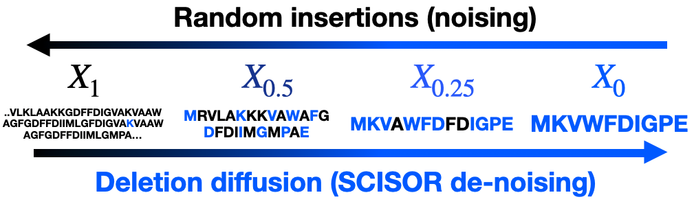

# SCISOR: A Diffusion Model to Shrink Proteins While Maintaining Their Function

[Ethan Baron](https://baronet2.github.io/)\*, [Alan N. Amin](https://alannawzadamin.github.io)\*, [Ruben Weitzman](https://rubenweitzman.github.io/), [Debora Susan Marks](https://www.deboramarkslab.com/deboramarks), [Andrew Gordon Wilson](https://cims.nyu.edu/~andrewgw/). * equal contribution

Paper: https://openreview.net/pdf?id=YqQoNJWY22



## Abstract
Many proteins useful in modern medicine or bioengineering are challenging to make in the lab, fuse with other proteins in cells, or deliver to tissues in the body because their sequences are too long. Shortening these sequences typically involves costly, time-consuming experimental campaigns. Ideally, we could instead use modern models of massive databases of sequences from nature to learn how to propose shrunken proteins that resemble sequences found in nature. Unfortunately, these models struggle to efficiently search the combinatorial space of all deletions, and are not trained with inductive biases to learn how to delete.

To address this gap, we propose SCISOR, a novel discrete diffusion model that deletes letters from sequences to generate protein samples that resemble those found in nature. To do so, SCISOR trains a de-noiser to reverse a forward noising process that adds random insertions to natural sequences.

As a generative model, SCISOR fits evolutionary sequence data competitively with previous large models. In evaluation, SCISOR achieves state-of-the-art predictions of the functional effects of deletions on ProteinGym. Finally, we use the SCISOR de-noiser to shrink long protein sequences, and show that its suggested deletions result in significantly more realistic proteins and more often preserve functional motifs than previous models of evolutionary sequences.

## Citation

If you use SCISOR, please cite our paper:

```
@inproceedings{SCISOR,
  title        = {A Diffusion Model to Shrink Proteins While Maintaining their Function},
  author       = {Baron, Ethan and Amin, Alan\,N. and Weitzman, Ruben and Marks, Debora\,S. and Wilson, Andrew\,G.},
  booktitle    = {ICML Workshop on Exploration in AI Today},
  year         = {2025},
  month        = {Jul},
  url          = {https://openreview.net/pdf?id=YqQoNJWY22},
}
```

## Usage

We provide the trained SCISOR models on HuggingFace at https://huggingface.co/SCISOR/SCISOR/tree/main.

### Installation

Install dependencies by running `pip install .` with a recent version of Python.

### Generating Unconditional Samples with SCISOR

Running `python sample_sequences.py` will produce a file `sampled_sequences.fasta`.

### Shrinking Proteins with SCISOR

Running `python shrink_sequences.py` takes in a `fasta` file like `sampled_sequences.fasta`, and produces a file `shrunk_sequences.fasta`.

### Training SCISOR with Uniref50

To train SCISOR on Uniref50, start by downloading the data and pre-processing it into batches:

```sh
wget -O uniref50.tar.gz "https://zenodo.org/records/6564798/files/uniref50.tar.gz?download=1"
tar -xvzf uniref50.tar.gz -C data
python data/preprocess_uniref50.py
```

Currently, `preprocess_uniref50.py` is set up to process 50 batches of 256 sequences, for demonstration purposes. If you wish to train on more data, increase `num_training_batches`.

Then run:
```sh
python train.py  --config-name=uniref50
```

If using `wandb`, the key is to watch `val_l01` go down! We suggest training with an A100 GPU.

The config parameters can be updated to specify the dataset path, model architecture, training hyperparameters, sampling settings, etc.

### Training SCISOR with Uniref90

To download the Uniref90 dataset, use:
```sh
wget https://ftp.uniprot.org/pub/databases/uniprot/uniref/uniref90/uniref90.fasta.gz
gunzip uniref90.fasta.gz
```

We provide the code we used to pre-process Uniref90. Due to this dataset's size, we follow the following steps:
1. Shuffle the dataset and save the shuffled dataset in separate shards (see `data/shuffle_uniref90.py`)
2. Preprocess each shard individually using `data/preprocess_uniref90_shard.py`

After preprocessing, the model can be trained with:
```sh
python train.py  --config-name=uniref90
```